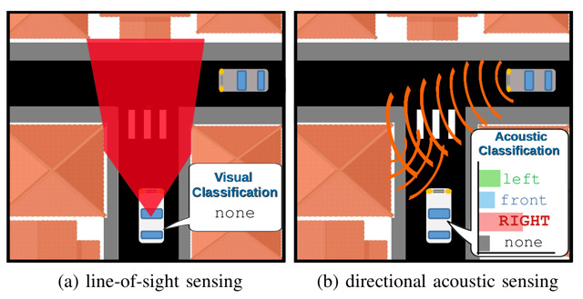
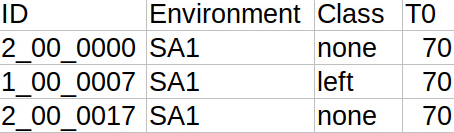

# Hearing What You Cannot See: Acoustic Vehicle Detection Around Corners 
Public repository of the paper "Hearing What You Cannot See: Acoustic Vehicle Detection Around Corners" (accepted IEEE Robotics and Automation Letters (RA-L), for 2021, [arxiv](https://arxiv.org/abs/2007.15739))

We present a data-driven acoustic detection method that can detect an
approaching vehicle before it enters line-of-sight, e.g. while hidden behind a
blind corner, in real-world outdoor conditions.
The code available here can be used to reproduce the results of our approach.
We also provide our novel audio-visual dataset
(OVAD - occluded vehicle acoustic detection) collected in outdoor
urban environments with a 56-microphone array mounted on our research vehicle.



## Dataset


The dataset provided within the scope of this publication is an audio-visual
set of real world traffic scenarios. You can download the data here:
https://surfdrive.surf.nl/files/index.php/s/XRdrcDCHaFQMgJz

The data is prepared for download in three separate zip files:
* `ovad_dataset_audio.zip` (~10GB) - Full 56-channel audio data (WAV-format,
  up to 10 seconds long) of all samples in the test set (83 static, 59 dynamic)
  and the detections per frame of our visual baseline as json-files. 
* `ovad_dataset_video.zip` (0.5GB) - Anonymized videos of the vehicle front-facing camera
  corresponding to the data in the `ovad_dataset_audio.zip`.
  Note: contains the same `DataLog.csv` as the audio zip-file.
* `ovad_dataset_samples.zip` (8GB) - 1 second 56-channel audio data
  (WAV-format) of all samples.

The data was recorded at five T-junction
locations with blind corners around the city of Delft, Netherlands. At these 
locations, the audio-visual recordings are made both when the ego-vehicle is
stationary (SA1, SB1, ...) and moving towards the T-junction (DA1, DB1, ...).
The table below summarizes the details of the dataset per location.

| Location Name | Location Abreviation | Enumeration | Coordinates | Recording Date | Amount (l,n,r) |
|---------------|----------------------|-------------|-------------|----------------|----------------|
| Anna Boogerd| SA1/DA1 | 00/05 | [52.01709452973826, 4.3555564919338465](https://www.google.com/maps/place/52%C2%B001'01.5%22N+4%C2%B021'20.0%22E/@52.0170945,4.3555565,17z/data=!3m1!4b1!4m5!3m4!1s0x0:0x0!8m2!3d52.0170945!4d4.3555565) | 12.12.2019/11.08.2020 | 14,30,16/19,37,19 |
| Kwekerijstraat | SA2/DA2 | 01/06 | [52.00874379638945, 4.353009285502861](https://www.google.com/maps/place/52%C2%B000'31.5%22N+4%C2%B021'10.8%22E/@52.0088594,4.352843,18z/data=!4m5!3m4!1s0x0:0x0!8m2!3d52.0087438!4d4.3530093) | 16.01.2020/16.01.2020 | 22,49,19/7,13,8 |
| Willem Dreeslaan | SB1/DB1 | 02/07 | [51.981244475986784, 4.366977041151884](https://www.google.com/maps/place/51%C2%B058'52.5%22N+4%C2%B022'01.1%22E/@51.9812445,4.366977,17z/data=!3m1!4b1!4m5!3m4!1s0x0:0x0!8m2!3d51.9812445!4d4.366977) | 12.12.2019/11.08.2020| 17,32,24/18,35,18 |
| Vermeerstraat | SB2/DB2 | 03/08 | [52.01649109239065, 4.361755580741086](https://www.google.com/maps/place/52%C2%B000'59.4%22N+4%C2%B021'42.3%22E/@52.0164911,4.3617556,17z/data=!3m1!4b1!4m5!3m4!1s0x0:0x0!8m2!3d52.0164911!4d4.3617556) | 16.01.2020/16.01.2020 | 28,43,27/10,22,12 |
| Geerboogerd | SB3/DB3 | 04/09 | [52.01730429561088, 4.354045642003781](https://www.google.com/maps/place/52%C2%B001'02.3%22N+4%C2%B021'14.6%22E/@52.0173043,4.3540456,17z/data=!3m1!4b1!4m5!3m4!1s0x0:0x0!8m2!3d52.0173043!4d4.3540456) | 12.12.2019/11.08.2020| 22,45,23/19,36,19 |

### Structure `ovad_dataset_audio.zip` and `ovad_dataset_video.zip` 
As described in the paper, the Faster R-CNN visual detections are only provided
for the static and not for the dynamic data.

```
ovad_dataset
│   DataLog.csv 				  # in _audio.zip & _video.zip
│
└───[environment]
│   └───left
│       └───[ID]
│       	│   camera_baseline_results.json  # _audio.zip
│       	│   out_multi.wav 		  # _audio.zip
│       	│   ueye_stereo_vid.mp4 	  # _video.zip
|	|   ...
│   └───none
│       └───[ID]
│       	│   camera_baseline_results.json
│       	│   out_multi.wav
│       	│   ueye_stereo_vid.mp4
|	|   ...
│   └───right
│       └───[ID]
│       	│   camera_baseline_results.json
│       	│   out_multi.wav
│       	│   ueye_stereo_vid.mp4
|	    ...
│   ...
```

The ID of each individual recording is enumarated in the format
```[X_XX_XXXX]```. 
The first part indicates the recording class as 1: left, 2: none, 3: right.
The second part indicates the location as stated in the table, and
the last part is an enumeration.

The ```DataLog.csv``` holds information about each recording.
The unique ID of the recording, the Environment described above, the recording
label and the T0 frame for this particular recording, a snapshot is posted here.

 

### Structure `ovad_dataset_samples.zip`

The samples will be stored in the following format:

```
samples
│   SampleLog.csv   
│
└───left
    |   ID.wav
    |   ...
└───front
    |   ID.wav
    |   ...
└───none
    |   ID.wav
    |   ...
└───right
    |   ID.wav
    |   ...
```
The ID follows the same structure as above, but with class-id 0 for the
additional front class.

## Quick start guide

To run the following script you need the file `ovad_dataset_audio.zip` and
optionally `ovad_dataset_video.zip`, if you wish to have a visual illustration
of the scenes.
Unpack the files in a folder ```[dataFolder]``` of your choice.
For full functionality both zips should be unpacked at the same destination.

In order to reproduce the results of the paper, follow the following steps using the provided, extracted features and a pre-trained classifier:

```
git clone https://github.com/tudelft-iv/occluded_vehicle_acoustic_detection.git
cd occluded_vehicle_acoustic_detection

# Install python libraries (tested with python 3.6.12)
pip install -r requirements.txt

# reproduce Figure 6a), 7 and 8 (including video visualization)
python timeHorizonInference.py --input [dataFolder]/ovad_dataset --output [outputFolder] --class ./config/timeHorizonStaticClassifierExcludedTestset.obj --csv ./config/timeHorizonStaticTestset.csv --vis --store --axis-labels

# reproduce Table III (using pre-extracted features, does not require zip file)
python classificationExpts.py --run_cross_val --locs_list DAB DA DB

# reproduce Table IV (using pre-extracted features, does not require zip file)
python classficationExpts.py --run_gen --train_locs_list SB --test_locs_list SA
python classficationExpts.py --run_gen --train_locs_list SA --test_locs_list SB
python classficationExpts.py --run_gen --train_locs_list DB --test_locs_list DA
python classficationExpts.py --run_gen --train_locs_list DA --test_locs_list DB
```

## Classification Experiments

The classification experiments carried out in the paper are implemented in the
script ```classificationExpts.py```. Before the classfication can be carried out
on the data subsets, the SRP-PHAT features have to be extracted from the 1
second audio samples. To save time, a file containing the extracted features
is provided at ```/config/extracted_features.csv```. If the features
have to be extracted again, then path to the 1 second audio samples should be
provided at ```--input```, along with the flag ```--extract_feats```. In
addition, ```--save_feats``` flag can be provided to save the extracted features
at ```/config/extracted_features.csv```. 

To get results for the cross validation experiments (as in Table III), run the
script as below. Specifying multiple arguments to the flag ```--locs_list```
will run the cross_validation on each location/environment separately.

``` 
python classificationExpts.py --run_cross_val --locs_list DAB DA DB
```

Another experiment that has been carried out in the paper is the generalization across locations and environments (Table IV). To get results here, run the script as: 
```
python classficationExpts.py --run_gen --train_locs_list SB --test_locs_list SA
```

Additionally, a classifier can be trained and tested on required data subset or a combination of multiple data subsets. The specified subsets will be combined and stratified split of data will be carried on the given data to ensure that samples from the same recording are not present in both train and test split. Either individual locations ```SA1, SA2 ...``` or  environment type ```SA``` to be combined can be specified for the flag ```--locs_list```. The script can be run as follows:
```
python classifcationExpts.py --train_save_cls --locs_list SAB --save_cls
```
The trained classifier can be saved when the script is run with the options ```--run_gen``` or ```--train_save_cls``` by specifying the flag ```--save_cls```. The result will be stored in a folder named ```saved_classifier``` alongside this script. If required, the results can also be stored at the required directory by specifying its path at the flag ```--output```.

## Time Horizon Inference

In order to run the experiment of the time horizon inference, run the script ```timeHorizonInference.py ``` with appropriate flags. For help use the flag ``` --help ```. Required arguments are ``` --input [dataFolder]/ovad_dataset --output [outputFolder] --class [classifierPath]```. The output path can be any of choice, the input path should point to the top level folder of the dataset.

An optional flag ``` --csv [pathToFilterCsv] ``` can and should be used to specify a test set. Without, the entire dataset will be processed. The csv file should at least include a column with ID's that are to be processed in the run. An example and the test set used is provided in ```/config/timeHorizonTestSet.csv```. It is possible to use a mixed set of static and dynamic data, however comparing with the visual baseline would be meaningless, since there are no visual detections provided in the dynamic environments.

The classifier path should be the full path to the classifier object file generated or provided in the repository under ```/config/timeHorizonClassifierExcludedTestData.obj```.

The additional flags ```--vis``` and ```--store``` can be used if an on the fly visualization shall be applied or if the overlay videos and plots shall be stored. The flag ```--axis-labels``` will produce labels on the figures as well. The results in form of data are always stored after a successful run of the script under ```/[outputFolder]/ResultTable.obj```. In order to create the overlay videos with stereo sound the ```ffmpeg``` package should be installed on the machine.

If the flag ```--store``` is used it will produce two additional folders in ```[outputFolder]/Plots``` and ```[outputFolder]/VideoOverlays``` in which the videos and figures will be stored. The figures include the average confidences per class and timestep, the normalized absolute classification results per class and timestep and one half of the mean feature vectors per timestep. In addition to the overall performance, the figures are further separated per environment. Additionally, the total accuracy as defined in the paper is plotted against the visual baseline. 

In order to redo the plotting after a successful run, the result table can be loaded in directly in a new ```DataHandler``` object by running:
```
import dataHandler as dh
rePlotter = dh.DataHandler(showViz=True)
rePlotter.loadResultTable([pathToResultTableObject])
rePlotter.postProcessing()
```

An example of the overlay is given below:


## Beamforming Visualization

Acoustic beamforming is used to create a 2D heatmap that is overlaid over the camera image to visualize the location of sailent sound sources around the Research Vehicle. This implementation uses the [Acoular](http://acoular.org/) framework for beamforming. The code to generate the overlaid video is implemented in the ```beamforming.py``` script. To generate overlays:

```
python beamforming.py --input [inputFolder]
```
By default, the overlaid videos will be saved in the directory of the input video file. Optionally, by specifying ```--output [outputFolder]``` alongside the above command, one can save the beamforming result to the required directory.

Beamforming overlay of a right recording at location SA2:

 

## Authors

Yannick Schulz

Avinash Kini Mattar

Thomas M. Hehn

Julian F. P. Kooij
